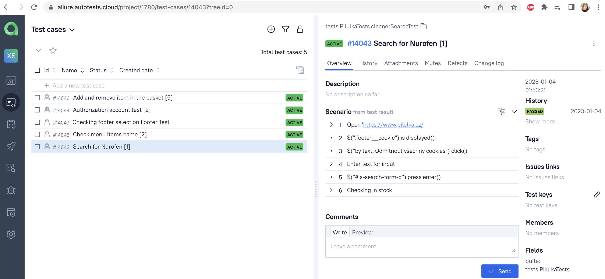

## Test automation project for https://pilulka.cz

##	Content

- [Technologies and tools](#technologist-technologies-and-tools)
- [Implemented checks](#bookmark-tabs-implemented-checks)
- [Running tests from the terminal](#computer-running-tests-from-the-terminal)
- [Running tests in Jenkins](#-running-tests-in-jenkins)
- [Test results report in Allure Report](#-test-results-report-in-allure-report)
- [Integration with Allure TestOps](#-integration-with-allure-testops)
- [Integration with Jira](#-integration-with-jira)
- [Telegram notifications using a bot](#-telegram-notifications-using-a-bot)
- [Test running example in Selenoid](#-test-running-example-in-selenoid)


## :technologist: Technologies and tools

<p  align="center">

<code></code>
<code></code>
<code></code>
<code></code>
<code></code>
<code></code>
<code></code>
<code></code>
<code></code>
<code></code>
<code></code>
<code></code>
</p>


## :bookmark_tabs: Implemented checks:
### UI Tests

- Menu display checking
- Product availability checking
- Checking the addition and deletion of goods from the basket
- Checking the display of the footer menu
- Authorization on the site with incorrect credentials 

## :computer: Running tests from the terminal

### Local running tests

```bash
gradle clean test
```

### Remote running tests

```bash
gradle clean test
-Dbrowser=${BROWSER}
-DbrowserVersion=${BROWSER_VERSION}
-DbrowserSize=${BROWSER_SIZE}
-Dremote=${SERVER_REMOTE}
```


##  Running tests in [Jenkins](https://jenkins.autotests.cloud/job/pilulka/)

Build needs to set options and customization options <code><strong>*Collect*</strong></code>.

<p align="center">
  
</p>

After build is completed, in the <code><strong>*Builds history*</strong></code> opposite the build number will appear
the *Allure Report* icon, clicking on which will open the page with the generated html-report.

<p align="center">
  
</p>


##  Test results report in [Allure Report](https://jenkins.autotests.cloud/job/hw_15_15_AutoTest/16/allure/)

<p align="center">
  
</p>


##  Интеграция с [Allure TestOps](https://allure.autotests.cloud/launch/18009)

## Main dashboard

<p align="center">
  
</p>

## Test cases

<p align="center">
  
</p>

##  Интеграция с [Jira](https://jira.autotests.cloud/browse/HOMEWORK-482)

<p align="center">
  
</p>

##  Telegram notifications using a bot
After the build is completed, a special bot created in <code>Telegram</code>, automatically processes and sends a test run report message.

<p align="center">

</p>

##  Test running example in Selenoid

A video is attached to each test in the report.

<p align="center">
  
</p>
